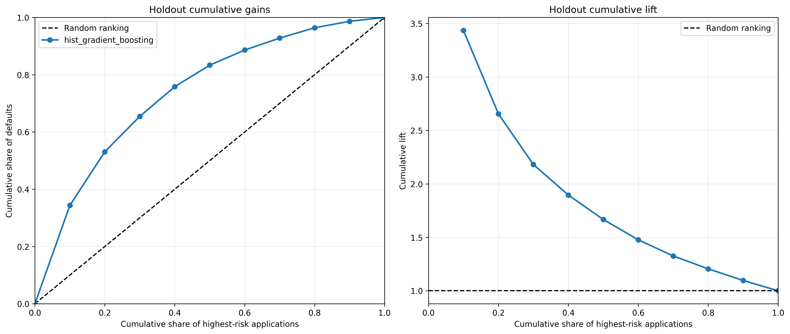

# Credit Risk Scoring

End-to-end probability-of-default modeling on the Home Credit Default Risk
dataset, with leakage-safe validation, model interpretation, risk segmentation
and an illustrative operational review policy.

## Executive summary

The project predicts whether a loan applicant will default (`TARGET = 1`) and
translates model scores into risk-management decisions. Model and threshold
choices are made on the development sample; the protected holdout is used only
for final evaluation.

| Result | Value |
|---|---:|
| Final model | Histogram Gradient Boosting |
| 5-fold CV ROC-AUC | 0.7627 ± 0.0018 |
| 5-fold CV Average Precision | 0.2448 ± 0.0056 |
| Holdout ROC-AUC | 0.7648 |
| Holdout Average Precision | 0.2530 |
| Holdout Brier score | 0.0674 |
| Holdout share reviewed in the base case | 19.96% |
| Defaults captured by that review group | 52.99% |
| Default rate inside that review group | 21.43% |
| Review lift | 2.65× |
| Illustrative savings versus no review | 10.01% |

The 10.01% figure is a sensitivity-analysis result under normalized assumptions,
not evidence of actual profitability. The proposed cutoff is a candidate manual
review threshold, not an automatic rejection rule.



## Business problem

Credit default is a highly imbalanced prediction problem: only about 8.1% of
applications in the labeled dataset are defaults. Accuracy is therefore not an
appropriate primary metric. The analysis focuses on:

- ranking quality through ROC-AUC;
- minority-class retrieval through Average Precision;
- probability quality through Brier score, log loss and calibration;
- operational usefulness through default capture, reviewed default rate and
  lift;
- decision sensitivity through review-cost, default-loss and intervention-
  effectiveness scenarios.

## Dataset

The data come from the
[Home Credit Default Risk competition](https://www.kaggle.com/c/home-credit-default-risk/data).
The raw competition files are not versioned in this repository.

The final models use application-level predictors from
`application_train.csv`. The remaining relational tables are audited during
data understanding but are not incorporated into the final model. This keeps
the pipeline focused and reproducible, but leaves historical bureau and payment
information as a clear extension.

## Validation design

The labeled applications are split once into:

- 80% development data;
- 20% protected holdout data;
- stratification on `TARGET`;
- `random_state = 42`.

Within the development sample, five-fold stratified cross-validation is used
for model comparison. Out-of-fold development probabilities are used to define
diagnostic thresholds, risk bands and operational policies. Those numerical
cutoffs are then frozen and applied unchanged to the holdout.

This design prevents direct holdout leakage. However, the split is random, not
out-of-time, so it does not establish temporal or macroeconomic stability.

## Modeling approach

### Preprocessing and feature engineering

All preprocessing is fitted inside scikit-learn pipelines. The workflow:

- validates identifiers, target and raw schema;
- handles the anomalous `DAYS_EMPLOYED = 365243` value;
- derives age, employment-duration, external-source availability and
  credit-to-income features;
- median-imputes numerical variables and adds missingness indicators;
- standardizes numerical features for logistic regression;
- one-hot encodes categories for logistic regression;
- ordinal-encodes categories for histogram gradient boosting;
- keeps model-specific feature views inside the pipeline.

### Models compared

- prior-probability dummy classifier;
- unweighted logistic regression;
- class-balanced logistic regression;
- histogram gradient boosting.

Histogram gradient boosting is the analytical champion because it provides the
strongest cross-validated discrimination and minority-class retrieval while
retaining acceptable probability quality. Unweighted logistic regression is
kept as the transparent benchmark.

### Evaluation and interpretation

The final evaluation includes:

- ROC and precision-recall curves;
- Brier score and log loss;
- percentile bootstrap intervals on holdout metrics;
- calibration tables and plots;
- development-designed diagnostic thresholds;
- logistic-regression coefficients;
- permutation importance for histogram gradient boosting.

Interpretation is associative rather than causal. Feature importance does not
show that changing a feature will change default risk.

## Business analysis

Risk bands are defined from development out-of-fold scores and transferred
unchanged to holdout. On the holdout sample, the high-risk group represents
19.96% of applicants and contains 52.99% of observed defaults.

Three capacity-based policies review approximately the highest-risk 10%, 20%
or 30% of applications. Under the explicit base-case assumptions—one normalized
unit per review, 15 units per default and 50% review effectiveness—the
development analysis selects the top-20% policy:

- score cutoff: approximately `0.1176`;
- holdout review share: `19.96%`;
- holdout default capture: `52.99%`;
- reviewed default rate: `21.43%`;
- holdout review lift: `2.65`;
- illustrative savings versus no review: `10.01%`.

Policy choice changes when the assumptions change. With low intervention
effectiveness, no review is preferred; with a higher relative default loss,
larger review capacities become preferable.

## Repository structure

```text
credit-risk-scoring/
├── README.md
├── requirements.txt
├── data/
│   ├── README.md
│   ├── raw/                         # not versioned                 
├── notebooks/
│   ├── 01_data_understanding.ipynb
│   ├── 02_eda.ipynb
│   ├── 03_preprocessing_feature_engineering.ipynb
│   ├── 04_modeling_baseline.ipynb
│   ├── 05_model_evaluation_interpretability.ipynb
│   └── 06_business_analysis.ipynb
├── src/
│   ├── __init__.py
│   ├── data_loader.py
│   ├── preprocessing.py
│   ├── features.py
│   ├── modeling.py
│   ├── evaluation.py


```

## Reproduction

### 1. Create the environment

Python 3.11 is recommended.

```bash
python -m venv .venv
source .venv/bin/activate
python -m pip install --upgrade pip
python -m pip install -r requirements.txt
```

On Windows PowerShell, activate the environment with:

```powershell
.\.venv\Scripts\Activate.ps1
```

### 2. Add the data

Download the competition archive from Kaggle, accept its rules and extract the
CSV files into `data/raw/`. In particular, the modeling pipeline requires:

```text
data/raw/application_train.csv
```

Notebook 01 expects the complete competition archive for its relational-table
inventory.

### 3. Validate and run

From the repository root:

```bash
python scripts/validate_project.py
python scripts/run_pipeline.py
python scripts/validate_project.py --require-executed --require-outputs
```

To rerun only the final three phases:

```bash
python scripts/run_pipeline.py --start 4 --end 6
```

Notebook execution is in place. Commit only deliberate notebook outputs and
selected report artifacts.

`configs/model_config.yaml` is the canonical experiment manifest and controls
the notebook runner. The notebooks currently contain matching analytical
constants explicitly; if an experiment setting is changed, keep the notebook
and manifest values synchronized.

## Limitations

- The final model uses only application-level data.
- Evaluation uses a random holdout rather than an out-of-time sample.
- No external-population validation has been performed.
- Cost, loss and intervention-effectiveness values are hypothetical.
- Review effectiveness is assumed, not causally estimated.
- No formal fairness or adverse-impact study has been completed.
- The analysis does not include exposure at default, loss given default,
  recovery, revenue or capital costs.

Before production use, the model would require out-of-time validation,
institution-specific economic inputs, legally appropriate subgroup testing,
reason-code governance, drift monitoring and a controlled shadow-mode pilot.

## Reproducibility rule

After the holdout evaluation is produced, do not tune features, hyperparameters,
calibration or thresholds against the same holdout and report it as an unbiased
final test. Any further iteration requires a new validation design.

